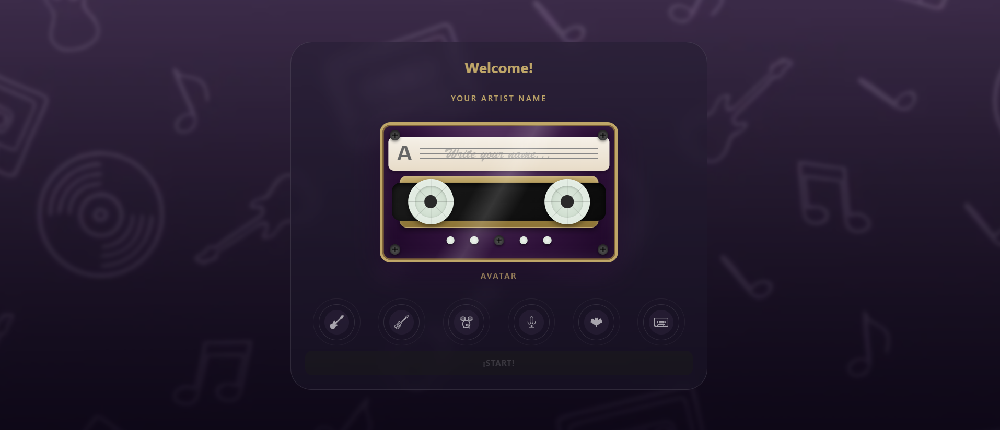
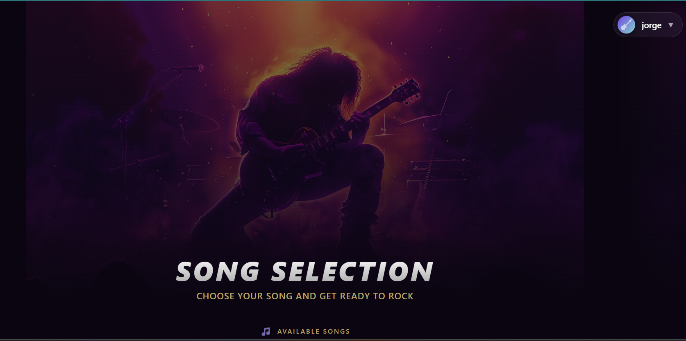
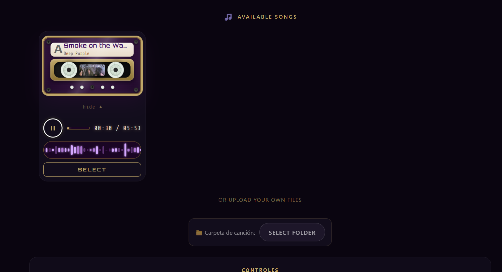

# 🎸 Guitar Hero React

A modern implementation of Guitar Hero built with **React**, **TypeScript**, and **Vite**, utilizing the **Web Audio API** and **HTML5 Canvas** for a smooth and accurate experience.


## ✨ Features

- 🎯 **Precise Synchronization**: Game engine based on audio time (`AudioContext.currentTime`) for perfect synchronization.
- 🔊 **Multi-channel Audio Support (Stems)**: Ability to load separate audio files (guitar, bass, drums, vocals) that mute when you miss a note.
- 📊 **Song Loading**: Support for `.chart` files (Clone Hero/Feedback) and custom JSON files.
- 🎨 **Canvas Rendering**: Optimized graphics using the Canvas 2D API.
- 🎛️ **Real-time Calibration**: Adjust audio/video offset during gameplay.
- 🎮 **Multiple Difficulties and Instruments**: Support for Easy, Medium, Hard, Expert, and different instruments defined in the song file.

## 🛠️ Technologies

- **Framework**: [React 19](https://react.dev/)
- **Language**: [TypeScript](https://www.typescriptlang.org/)
- **Build Tool**: [Vite](https://vitejs.dev/)
- **Audio**: [Web Audio API](https://developer.mozilla.org/en-US/docs/Web/API/Web_Audio_API)
- **Graphics**: [Canvas API](https://developer.mozilla.org/en-US/docs/Web/API/Canvas_API)

## 🚀 Quick Start

### Prerequisites

- [Node.js](https://nodejs.org/) (version 18 or higher recommended)
- npm or yarn

### Installation

1. Clone the repository:
   ```bash
   git clone https://github.com/JDavidcor23/Guitar-Hero-React.git
   cd guitar-hero-react
   ```

2. Install dependencies:
   ```bash
   npm install
   ```

3. Start the development server:
   ```bash
   npm run dev
   ```

## 🎮 How to Play

### Controls

| Action | Key |
| :--- | :--- |
| **Lane 1 (Green)** | `A` |
| **Lane 2 (Red)** | `S` |
| **Lane 3 (Yellow)** | `D` |
| **Lane 4 (Blue)** | `F` |
| **Lane 5 (Orange)** | `J` |
| **Pause / Resume** | `Space` |
| **Increase Offset (+10ms)** | `+` or `=` |
| **Decrease Offset (-10ms)** | `-` or `_` |

### Instructions

1. **Select Song**: In the main menu, load a `.chart` file or select a song folder containing the notes file and audio files.
2. **Configure**: Choose the instrument (Guitar, Bass, Drums, etc.) and difficulty.
3. **Play!**: Press the corresponding keys when the notes reach the impact zone at the bottom.
4. **Sustains**: For notes with "tails", hold the key until the tail ends to get extra points.

## 📁 Project Structure

The project is organized following the **Proximity Principle**, with functionalities divided into self-contained features:

```text
src/
├── features/
│   ├── start-screen/        # Landing page and initial interaction
│   ├── game-menu/           # Song selection and file loading
│   ├── gameplay/            # Core game logic, rendering, and audio
│   ├── game-results/        # Final statistics screen
│   └── user-profiles/       # User profile management and High Scores
├── components/              # Global and reusable components
├── hooks/                   # Shared hooks between features
├── assets/                  # Global styles, images, and fonts
└── App.tsx                  # Main orchestrator handling game states
```

## 🖼️ Gallery





## 📝 License

This project is under the MIT License. See the `LICENSE` file for more details.

---
Made by [JDavidcor23](https://github.com/JDavidcor23)
