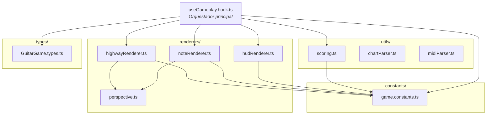
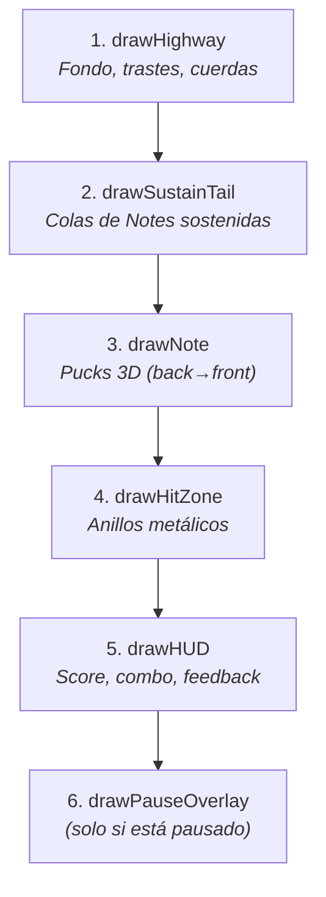

# Gameplay Engine — Arquitectura de Módulos

## Diagrama General

---

## Módulos

### `hooks/useGameplay.hook.ts` — Orquestador
> **~330 líneas** | Depende de React

El corazón del juego. Contiene el `useEffect` principal con:

- **Game Loop** (`requestAnimationFrame`) — ciclo de 60fps
- **Sistema de tiempo** — sincroniza con audio o usa `performance.now()`
- **Spawning de Notes** — aparece Notes según el tiempo de la canción
- **Movimiento de Notes** — actualiza posición Y cada frame
- **Detección de hits** — compara posición de nota vs hit zone al presionar tecla
- **Input handling** — escucha `keydown`/`keyup` para teclas A, S, D, F, J
- **Sustain tracking** — rastrea Notes sostenidas y calcula puntos por segundo
- **Orquestación de render** — llama a los renderers en el orden correcto

---

### `renderers/perspective.ts` — Proyección 3D
> **~60 líneas** | Función pura

Convierte coordenadas 2D abstractas a coordenadas de pantalla con perspectiva.

| Función | Descripción |
|---------|-------------|
| `getPerspective(x, abstractY)` | Devuelve `{ x, y, scale }` en pantalla |

**Constantes clave:**
- `Z_NEAR = 2` / `Z_FAR = 8` — rango de profundidad
- `HORIZON_Y = 200` — línea del horizonte
- `BASE_SCALE_MULTIPLIER = 1.4` — tamaño global del highway

---

### `renderers/highwayRenderer.ts` — Fondo del Highway
> **~95 líneas** | Función pura

Dibuja el "pasillo" por donde bajan las Notes.

| Función | Descripción |
|---------|-------------|
| `drawHighway(ctx, canvas, gameTime)` | Dibuja fondo, bordes, trastes y cuerdas |

**Elementos visuales:**
- Cuerpo oscuro con gradiente (`#111116` → `#050508`)
- Bordes laterales metálicos (`#555555`)
- Trastes horizontales animados (se mueven con `gameTime`)
- Cuerdas verticales (una por carril, `rgba(255,255,255,0.15)`)

---

### `renderers/noteRenderer.ts` — Notes y Hit Zone
> **~195 líneas** | Funciones puras

Dibuja las Notes (pucks 3D), las colas de sustain y los anillos de la zona de hit.

| Función | Descripción |
|---------|-------------|
| `drawNote(ctx, lane, abstractY)` | Dibuja un puck cilíndrico 3D |
| `drawSustainTail(ctx, lane, headY, tailEndY, ...)` | Dibuja la cola de una nota sostenida |
| `drawHitZone(ctx, laneFlashes, currentTime)` | Dibuja los anillos metálicos inferiores |

**Anatomía de un Puck (de abajo a arriba):**
1. Sombra (elipse oscura)
2. Paredes del cilindro (gradiente gris)
3. Tapa metálica (gradiente radial plateado)
4. Zona de color (gradiente con el color del carril)
5. Núcleo blanco central

---

### `renderers/hudRenderer.ts` — Interfaz de Usuario
> **~155 líneas** | Funciones puras

Dibuja toda la información en pantalla durante el gameplay.

| Función | Descripción |
|---------|-------------|
| `drawHUD(ctx, stats, lastHit, ...)` | Score, combo, progreso, feedback |
| `drawPauseOverlay(ctx)` | Overlay de pausa |

**Secciones del HUD:**
- ↖ Esquina sup. izquierda: Score, Combo, Max Combo, Multiplicador
- ↑ Centro superior: Nombre de canción, Tiempo, Barra de progreso
- ↗ Esquina sup. derecha: Perfect/Good/OK/Miss
- Centro: Texto de feedback (PERFECT!, GOOD, OK, MISS)

---

### `utils/scoring.ts` — Score
> **~50 líneas** | Funciones puras

Calcula multiplicadores y puntos.

| Función | Descripción |
|---------|-------------|
| `getMultiplier(combo)` | Devuelve `{ multiplier, color }` según el combo |
| `calculatePoints(result, combo)` | Puntos base × multiplicador |

**Tabla de multiplicadores:**

| Combo | Multiplicador | Color |
|-------|--------------|-------|
| 0-9 | x1 | Blanco |
| 10-19 | x2 | Amarillo |
| 20-29 | x3 | Naranja |
| 30+ | x4 | Rojo |

---

### `constants/game.constants.ts` — Configuración
> **~198 líneas**

Todas las constantes numéricas del juego: dimensiones del canvas, posiciones de carriles, colores, ventanas de hit, puntos, teclas, configuración de sustains.

---

### `types/GuitarGame.types.ts` — Tipos TypeScript
> **~146 líneas**

Interfaces y tipos: `GameNote`, `GameStats`, `SongData`, `HitResult`, `LaneFlashState`, etc.

---

## Orden de Rendering (cada frame)

